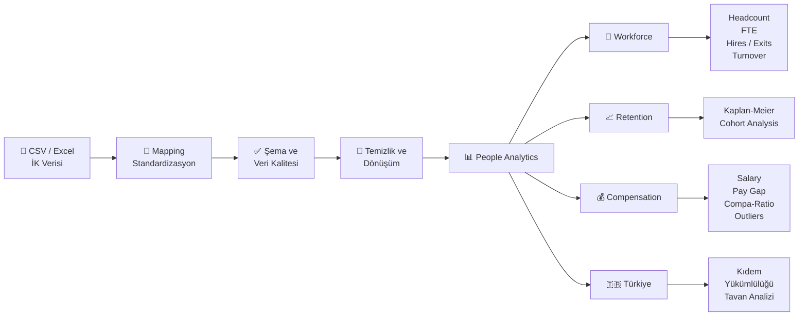
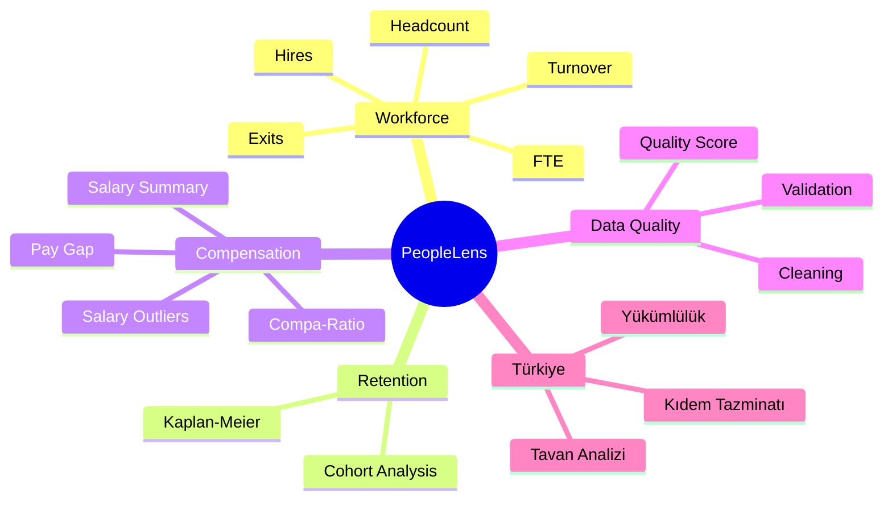
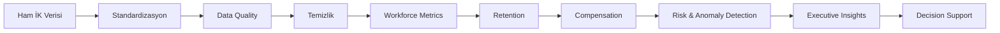

<div align="center">

# PeopleLens

### Dağınık İK verisini güvenilir metriklere ve karar desteğine dönüştüren açık kaynak People Analytics ürünü

**Veri kalitesi · Workforce Analytics · Retention · Compensation · Türkiye kıdem analizi**

</div>

---

PeopleLens; farklı şirketlerden gelen CSV / Excel tabanlı İK verilerini ortak bir çalışan veri modeline dönüştürür, veri kalitesini kontrol eder ve aynı veri modeli üzerinden workforce, retention, compensation ve Türkiye kıdem analizleri üretir.

Amaç yalnızca dashboard üretmek değil, **ham çalışan verisinden güvenilir ve tekrar üretilebilir analitik sonuçlara ulaşan bir karar destek katmanı** oluşturmaktır.

> Bu repodaki demo veriler tamamen sentetiktir. Gerçek çalışan verisi içermez ve gerçek çalışan verisi repoya yüklenmemelidir.

---

## PeopleLens nasıl çalışır?



---

## Öne çıkan özellikler

- Standart çalışan veri modeli
- CSV / Excel veri eşleme
- YAML tabanlı mapping
- Veri kalite kontrolleri
- Veri temizleme
- Headcount ve FTE
- Hires / Exits
- Turnover
- Kaplan-Meier retention analizi
- Compensation analytics
- Gender pay gap
- Compa-ratio
- Salary midpoint analizi
- Salary outlier detection
- Job level analizi
- Age / location / performance alanları
- Türkiye kıdem tazminatı analizi
- Streamlit dashboard
- Sentetik şirket veri üreticisi
- Otomatik testler
- Minimum grup büyüklüğü ile gizlilik kontrolü

---

# Hızlı başlangıç

## 1. Repo'yu klonlayın

```bash
git clone https://github.com/tollal/peoplelens.git
cd peoplelens
```

## 2. Bağımlılıkları kurun

```bash
uv sync
```

Dashboard bağımlılıkları için:

```bash
uv sync --extra dashboard
```

## 3. Testleri çalıştırın

```bash
uv run pytest -q
```

## 4. Dashboard'u başlatın

```bash
uv run --extra dashboard streamlit run dashboard/app.py
```

Uygulama varsayılan olarak şu adreste açılır:

```text
http://localhost:8501
```

Dashboard yerel çalışır. Yüklediğiniz dosyalar bilgisayarınızdan çıkmaz.

---

# Dashboard

PeopleLens dashboard'u beş ana analitik modülden oluşur.

```mermaid
flowchart TD
    A["PeopleLens Dashboard"]

    A --> B["Overview"]
    A --> C["Data Quality"]
    A --> D["Retention"]
    A --> E["Compensation"]
    A --> F["Turkey Severance"]

    B --> B1["Headcount"]
    B --> B2["FTE"]
    B --> B3["Hires / Exits"]
    B --> B4["Turnover"]
    B --> B5["Workforce Distribution"]

    C --> C1["Quality Score"]
    C --> C2["Validation"]
    C --> C3["Cleaning"]
    C --> C4["Issue Detection"]

    D --> D1["Kaplan-Meier"]
    D --> D2["Cohort Analysis"]
    D --> D3["Department Retention"]

    E --> E1["Salary Summary"]
    E --> E2["Gender Pay Gap"]
    E --> E3["Compa-Ratio"]
    E --> E4["Salary Outliers"]
    E --> E5["Job Level Analysis"]

    F --> F1["Gross Liability"]
    F --> F2["Severance Ceiling"]
    F --> F3["Department Exposure"]
```



## Overview

Yönetici seviyesinde temel workforce görünümünü sunar.

Örnek metrikler:

- Employees
- FTE
- Hires
- Exits
- Turnover
- Average Age
- Average Performance
- Location Count
- Manager Count

Ayrıca:

- Workforce by Department
- Headcount Trend
- Workforce by Job Level
- Gender Mix
- Turnover by Department

gibi dağılımlar gösterilebilir.

---

## Data Quality

PeopleLens analiz üretmeden önce verinin güvenilir olup olmadığını kontrol eder.

Kontroller arasında şunlar bulunur:

- eksik departman
- duplicate employee ID
- negatif veya sıfır maaş
- olağan dışı maaş değerleri
- geçersiz FTE
- işe giriş tarihinden önce çıkış
- çıkış tarihi olmadan çıkış tipi
- çıkış tipi olmadan çıkış tarihi
- gelecekte işe giriş tarihi
- sistemde bulunmayan manager ID
- çalışanın kendisinin yöneticisi olması
- departman isimlerinde yazım varyasyonları

Dashboard üzerinden:

- ham veri kalite skoru
- başarısız kontroller
- temizlik sonrası kalite skoru
- problem listesi
- dönüşüm notları
- uygulanan temizlik adımları

görülebilir.

Temizlenmiş veri CSV olarak dışa aktarılabilir.

---

# Workforce Analytics

PeopleLens çalışan yaşam döngüsünü ortak metrik tanımları üzerinden analiz eder.

## Headcount

Belirli bir tarihte aktif çalışan sayısıdır.

PeopleLens'te:

- çalışan işe giriş tarihinde aktif kabul edilir
- `termination_date` son çalışma günüdür
- çalışan çıkış tarihinde aktif kabul edilir
- çıkış tarihinden sonraki gün headcount dışında kalır

Bu yaklaşım headcount ve turnover hesaplarının tarih bazında tutarlı kalmasını sağlar.

## FTE

Çalışanın iş gücü kapasitesini ifade eder.

Örnek:

```text
1.0 = tam zamanlı
0.8 = %80 çalışma
0.5 = yarı zamanlı
```

Bu sayede yalnızca çalışan sayısı değil, toplam iş gücü kapasitesi de ölçülebilir.

## Hires

Belirlenen dönem içinde işe başlayan çalışan sayısıdır.

## Exits

Belirlenen dönem içinde ayrılan çalışan sayısıdır.

Ayrılmalar:

- All
- Voluntary
- Involuntary

olarak ayrıca analiz edilebilir.

## Turnover

Temel turnover yaklaşımı:

```text
Ayrılan çalışan sayısı
-----------------------------
Ortalama Headcount
```

Ortalama headcount:

```text
(Dönem başı HC + dönem sonu HC) / 2
```

Turnover şirket geneli veya departman bazında analiz edilebilir.

---

# Retention Analytics

PeopleLens çalışan elde tutma analizinde Kaplan-Meier yaklaşımını kullanır.

Amaç şu soruyu yanıtlamaktır:

> İşe başlayan çalışanların yüzde kaçı 6, 12 ve 24 ay sonra hâlâ şirkette?

Analiz:

- şirket geneli
- departman bazında
- voluntary exit
- involuntary exit
- farklı cohort başlangıç tarihleri

üzerinden çalıştırılabilir.

Örnek kullanım:

```python
from peoplelens.attrition import retention_table

table = retention_table(
    df,
    "2026-09-30",
    cohort_start="2021-10-01",
)

print(table)
```

Kaplan-Meier yaklaşımı sağ sansürlü gözlemleri dikkate aldığı için yalnızca bugün şirkette kalan çalışanlara bakmaktan daha doğru bir retention görünümü sağlar.

---

# Compensation Analytics

PeopleLens ücret tarafında yalnızca ortalama maaş göstermek yerine, ücret yapısının farklı boyutlarını analiz eder.

## Salary Summary

Departman bazında:

- çalışan sayısı
- ortalama maaş
- medyan maaş
- minimum maaş
- maksimum maaş

hesaplanabilir.

## Salary Outlier Detection

Olağan dışı maaş değerleri IQR yaklaşımıyla tespit edilir.

Outlier türleri:

```text
low
normal
high
```

olarak sınıflandırılır.

Bu analiz:

- veri hatalarını
- ücret anomalilerini
- sıra dışı maaş pozisyonlarını

incelemek için kullanılabilir.

## Gender Pay Gap

Kadın ve erkek çalışanlar arasındaki ham ortalama ücret farkı hesaplanabilir.

Örnek:

```text
Male average salary:   100.000 TL
Female average salary: 94.000 TL

Raw pay gap: 6%
```

Bu sonuç ham ücret farkıdır.

Departman, job level, tenure, performance ve location gibi faktörleri kontrol eden adjusted pay equity modeli ayrı bir geliştirme alanıdır.

## Compa-Ratio

Compa-ratio, çalışanın maaşını ilgili salary midpoint'e göre değerlendirir.

```text
Compa-Ratio = Çalışan Maaşı / Salary Midpoint
```

Örnek:

```text
0.90 = midpoint'in %10 altında
1.00 = midpoint seviyesinde
1.10 = midpoint'in %10 üzerinde
```

PeopleLens:

- average compa-ratio
- midpoint altında çalışan sayısı
- midpoint ve üzerinde çalışan sayısı
- job level bazlı compa-ratio

analizleri üretir.

---

# Sentetik Şirket Üreteci

PeopleLens gerçek çalışan verisi paylaşmadan ürünün test edilebilmesi için sentetik şirket verisi üretebilir.

Sentetik veri modeli şu alanları içerebilir:

```text
employee_id
hire_date
termination_date
termination_type
department
job_title
manager_id
fte
monthly_salary
gender
age
location
job_level
performance_rating
salary_midpoint
```

Üretici:

- departman dağılımı
- işe giriş tarihleri
- tenure
- ayrılma davranışı
- maaş
- job level
- performans
- lokasyon
- cinsiyet
- manager ilişkileri

gibi alanları kontrollü ve tekrar üretilebilir şekilde oluşturur.

Aynı `seed` ile aynı veri tekrar üretilebilir.

Bu özellik otomatik testler için önemlidir.

---

# Kendi İK verinizi kullanma

Farklı şirketlerin kolon isimleri YAML mapping dosyasıyla PeopleLens standart veri modeline eşlenir.

Örneğin şirket dosyanızda şu kolonlar bulunabilir:

```text
Sicil No
İşe Giriş Tarihi
Bölüm
Pozisyon
Brüt Ücret
Çıkış Tarihi
Çıkış Nedeni
```

Mapping dosyası:

```yaml
columns:
  employee_id: Sicil No
  hire_date: İşe Giriş Tarihi
  department: Bölüm
  job_title: Pozisyon
  monthly_salary: Brüt Ücret
  termination_date: Çıkış Tarihi
```

Bu sayede şirketin kolon isimleri değişse bile analitik fonksiyonlar değişmeden çalışır.

Türkiye'deki tipik dışa aktarımlar da normalize edilebilir:

- noktalı virgülle ayrılmış CSV dosyaları
- `gg.aa.yyyy` tarih formatları
- `45.000,50` gibi yerel sayı formatları
- Türkçe çıkış nedenleri
- eksik opsiyonel alanlar
- farklı kolon isimleri

Yapılan dönüşümler sessizce geçilmek yerine not olarak raporlanır.

Excel desteği için:

```bash
uv add openpyxl
```

kullanılabilir.

---

# Türkiye Kıdem Modülü

PeopleLens'in Türkiye'ye özel modülü kıdem tazminatı analizleri için geliştirilmiştir.

Amaç şu sorulara yanıt verebilmektir:

> Bugün bilanço tarihi olsa yaklaşık kıdem yükümlülüğü ne kadar?

> Hangi departman daha fazla kıdem yükü taşıyor?

> Kaç çalışan kıdeme hak kazanmış durumda?

> Kaç çalışanda kıdem tavanı devreye giriyor?

Örnek kullanım:

```python
from peoplelens.turkey import (
    severance_liability,
    liability_summary,
)

liab = severance_liability(
    df,
    "2026-09-30",
)

print(
    liab["gross_liability"].sum()
)

print(
    liability_summary(liab)
)
```

Modül:

- kıdem tazminatı tavanı
- çalışan bazlı kıdem yükümlülüğü
- departman bazlı toplam yükümlülük
- kıdeme hak kazanan çalışan sayısı
- tavanın devreye girdiği çalışanlar
- geçmiş kıdem maliyeti

hesaplamalarını destekler.

> Hesaplanan değer aktüeryal TMS 19 karşılığı veya hukuki görüş değildir.

---

# Veri Kalitesi ve Test Yaklaşımı

PeopleLens'te test edilebilirlik temel tasarım ilkelerinden biridir.

Sentetik veri üreticisine bilerek problemler eklenebilir.

Örnek problemler:

```text
missing_department
salary_non_positive
salary_outlier
fte_out_of_range
termination_before_hire
terminated_without_type
type_without_termination_date
manager_not_found
self_manager
future_hire_date
duplicate_employee_id
```

Testler:

- eklenen problemlerin beklenen sayıda bulunmasını
- temiz veride yanlış alarm oluşmamasını
- metriklerin deterministik olmasını
- compensation fonksiyonlarının beklenen sonucu üretmesini
- retention hesaplarının çalışmasını
- Türkiye kıdem hesaplamalarının doğruluğunu

kontrol eder.

Tüm testleri çalıştırmak için:

```bash
uv run pytest -q
```

---

# Analitik kapsam



---

# Proje yapısı

```text
peoplelens/
│
├── dashboard/
│   └── app.py
│
├── src/
│   └── peoplelens/
│       ├── attrition.py
│       ├── clean.py
│       ├── compensation.py
│       ├── mapping.py
│       ├── metrics.py
│       ├── quality.py
│       ├── schema.py
│       ├── synthetic.py
│       └── turkey.py
│
├── tests/
├── examples/
├── docs/
├── README.md
├── pyproject.toml
└── uv.lock
```

---

# Gizlilik

İK verisi kişisel ve hassas veri içerebilir.

Bu nedenle:

- gerçek çalışan verisini GitHub'a yüklemeyin
- gerçek CSV / Excel dosyalarını repo dışında tutun
- gerekli durumlarda anonimleştirme uygulayın
- küçük gruplarda yeniden tanımlama riskine dikkat edin
- KVKK / GDPR gibi ilgili mevzuata uygun hareket edin

Dashboard içinde ayarlanabilir minimum grup büyüklüğü kuralı bulunur.

Bu eşikten küçük gruplar raporlarda gizlenebilir.

Örneğin minimum grup büyüklüğü `5` ise 3 kişilik hassas bir alt grubun kırılımı gösterilmez.

---

# Yol haritası

## Tamamlananlar

- [x] Standart çalışan veri modeli
- [x] Schema validation
- [x] Sentetik şirket üreteci
- [x] Veri kalite motoru
- [x] Temel veri temizleme
- [x] YAML mapping engine
- [x] CSV / Excel veri akışı
- [x] Headcount
- [x] FTE
- [x] Hires / Exits
- [x] Turnover
- [x] Voluntary / involuntary ayrımı
- [x] Kaplan-Meier retention
- [x] Data Quality Score
- [x] Streamlit dashboard
- [x] Minimum grup büyüklüğü
- [x] Türkiye kıdem modülü
- [x] Salary Summary
- [x] Salary Outlier Detection
- [x] Gender Pay Gap
- [x] Compa-Ratio
- [x] Job Level analytics
- [x] Age / Location / Performance alanları
- [x] Salary Midpoint

## Sıradaki geliştirmeler

### Adjusted Pay Equity

Ham ücret farkının ötesine geçerek:

- gender
- job level
- department
- tenure
- performance
- location

gibi faktörleri kontrol eden adjusted pay equity analizi.

### Attrition Intelligence

Açıklanabilir çalışan ayrılma analizi.

Planlanan yapı:

- Logistic Regression
- Random Forest / XGBoost
- feature importance
- SHAP
- segment bazlı risk analizi

Amaç tek tek çalışanlara kesin ayrılma etiketi vermek değil, hangi çalışan segmentlerinde riskin arttığını ve bunu hangi değişkenlerin sürüklediğini göstermek.

### Executive Insight Engine

PeopleLens metrikleri hesapladıktan sonra önemli bulguları otomatik olarak öne çıkaracak.

Örnek:

```text
Customer Support turnover şirket ortalamasının üzerinde.
```

```text
Senior çalışanların ortalama compa-ratio değeri midpoint seviyesinin üzerinde.
```

```text
Finance retention değeri şirket geneline göre daha düşük.
```

```text
Birden fazla salary outlier manuel inceleme gerektiriyor.
```

Amaç yöneticinin her grafiği tek tek yorumlamak zorunda kalmamasıdır.

### Scenario Simulation

What-if analizleri:

```text
Maaşları %10 artırırsak aylık payroll ne olur?
```

```text
Turnover 3 puan düşerse yaklaşık kaç çalışan elde tutulur?
```

```text
Kıdem tavanı artarsa yükümlülük ne kadar değişir?
```

### Benchmarking

Birden fazla şirket veya dönem arasında:

- turnover
- retention
- compensation
- headcount
- pay equity

karşılaştırmaları.

### Executive Export

Dashboard çıktılarının:

- PDF
- PowerPoint
- CSV

formatlarında dışa aktarılması.

### Anonimleştirme

Planlanan privacy katmanı:

- employee ID hashing
- PII masking
- küçük grup gizleme
- export seviyesinde privacy kontrolleri

### PyPI

Uzun vadede:

```bash
pip install peoplelens
```

ile kurulabilir bir paket haline getirilmesi hedeflenmektedir.

---

# Uzun vadeli ürün vizyonu



PeopleLens'in uzun vadeli amacı:

> **Ham çalışan verisini doğrudan güvenilir analitik çıktılara ve yönetim karar desteğine dönüştüren açık kaynak bir People Analytics katmanı oluşturmaktır.**

---

## Lisans

MIT

---

<div align="center">

**Tolga tarafından geliştirilmiştir.**

</div>
