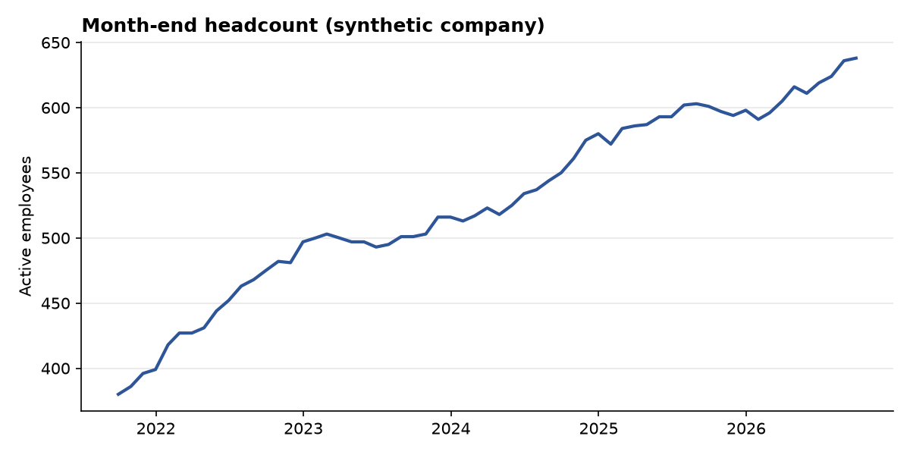
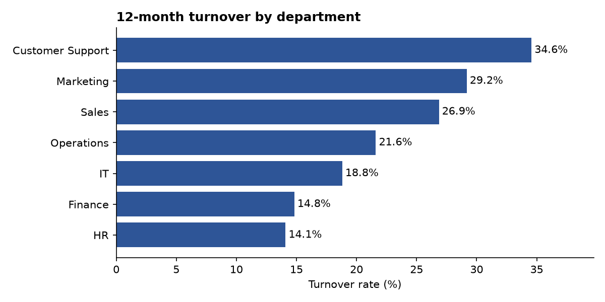
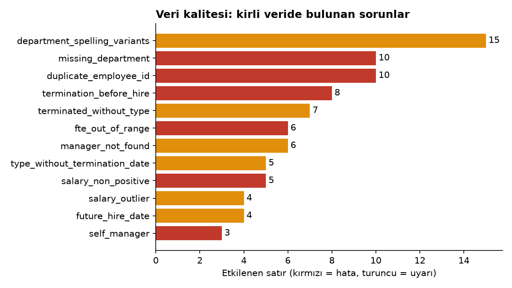

# peoplelens

**An open-source HR analytics toolkit that turns messy HR exports from any company into trusted, tested metrics.**

Every company exports HR data differently, and every export is dirty. `peoplelens` puts one standard data model in the middle: you describe a company's file in a small YAML mapping, and the same quality checks and metric definitions run on top, unchanged.

> All data in this repository is **synthetic**. No real employee data is, or should ever be, committed here.

## How it works

```
Raw export (CSV / Excel)
        |   YAML mapping (one per company)
        v
  Canonical employee table   <- schema validation
        |
        +--> Data quality engine   (14 checks, error / warning severity, quality score)
        +--> Metric library        (headcount, FTE, hires, terminations, turnover)
```

## What it looks like





The last chart comes from a file where errors were injected on purpose. The tests check that **every injected error is found, with the exact count**, and that a clean company produces zero false alarms.

## Quickstart

```bash
git clone https://github.com/tollal/peoplelens.git
cd peoplelens
uv sync
uv run pytest
uv run python examples/demo.py
```

```python
from peoplelens.mapping import load_company
from peoplelens.quality import run_checks, quality_score
from peoplelens.metrics import turnover_by

df, notes = load_company("examples/sirket_a_ham.csv", "examples/sirket_a.yaml")
print(quality_score(df, "2026-09-30"))
print(run_checks(df, "2026-09-30"))
print(turnover_by(df, "2025-10-01", "2026-09-30"))
```

## Onboarding a new company

Copy `examples/sirket_a.yaml` and change the column names. The example handles a Turkish-style export: `;` separated, `dd.mm.yyyy` dates, `45.000,50` salaries, and local termination reasons (`İstifa`, `İşten Çıkarma`) mapped to `voluntary` / `involuntary`. Missing optional columns fall back to defaults, and every conversion is reported back as a note instead of failing silently.

## Metric definitions

Definitions live in the docstrings of `src/peoplelens/metrics.py` and are covered by tests.

- **Headcount**: employees active on a date. `termination_date` is the last working day and counts as active.
- **Turnover rate**: terminations in the period / average headcount, where average = (opening + closing) / 2. Optional annualization and voluntary / involuntary split.

## Turkey module

Severance (*kıdem tazminatı*) and notice (*ihbar tazminatı*) calculations, with the statutory ceiling table built in. It answers the CFO question "what would we owe if everyone left today?" per employee and per department.

```python
from peoplelens.turkey import severance_liability, liability_summary

liab = severance_liability(df, "2026-09-30")
print(liab["gross_liability"].sum())
print(liability_summary(liab))
```

Notes: the ceiling table lives in `turkey.py` and must be updated every January and July (dates outside the table raise an error instead of guessing). The liability is an upper bound, not an actuarial TMS 19 provision, and this is not legal advice.

## Retention analysis

Kaplan-Meier retention curves answer "what share of new hires is still here after 6, 12, 24 months?", by department. It is validated against the known true curve of the synthetic generator.

```python
from peoplelens.attrition import retention_table

print(retention_table(df, "2026-09-30", cohort_start="2021-10-01"))
```

Only people hired inside the analysis window are used, to avoid survivorship bias.
## Privacy

Real HR data is personal data. Keep it outside the repository (`data/` and `*.xlsx` are git-ignored) and follow your local regulations, such as KVKK in Turkey or GDPR in the EU.

## Roadmap

- [x] Canonical schema and validation
- [x] Synthetic company generator
- [x] Data quality engine
- [x] Core metrics
- [x] Mapping engine (CSV / Excel to canonical)
- [ ] Interactive dashboard
- [x] Retention analysis (Kaplan-Meier survival curves)
- [ ] Attrition prediction (explainable model)
- [ ] Pay equity analysis
- [x] Turkey module: severance (kıdem) and notice (ihbar) pay, balance-sheet liability
- [ ] Turkey module: minimum wage impact
- [ ] Privacy layer (minimum group size, anonymization)

## Türkçe özet

`peoplelens`, farklı şirketlerin dağınık İK dosyalarını tek bir standart modele çeviren, veri kalitesini ölçen ve testli İK metrikleri (headcount, turnover) hesaplayan açık kaynaklı bir Python kütüphanesidir. Her şirket için yalnızca bir YAML eşleme dosyası yazılır, geri kalan her şey aynı kalır. Depodaki tüm veriler sentetiktir. Kıdem tazminatı ve asgari ücret etkisi gibi Türkiye'ye özgü analizler yol haritasındadır.

---
Built by [Tolga](https://github.com/tollal).